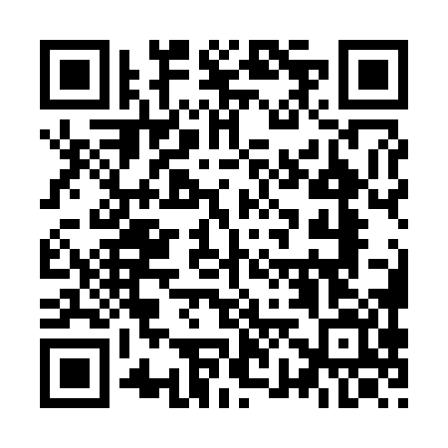

# First Use

When using the camera for the first time, it is necessary to associate it with one (or more) WiFi networks with internet access. The network name and password are stored by the unit. The procedure must be repeated if:

1. The network name or password is changed.
2. You want to associate the unit with a new network (the old ones remain in memory).

## Requirements

- A device that can connect to a WiFi network with a browser (phone, tablet, PC, etc.).
- A WiFi network with internet access of which you know the name and password and that **does not require subsequent authentication** via browser.

Attention: if the network is created as a hotspot from a phone, it is necessary to have a second device (another phone, a tablet, or PC) to perform this procedure (it is not possible to do it from the same device that creates the connection).

## Association Procedure

1. Ensure that the hotspot or WiFi network is active before turning on the unit.
2. Turn on the unit. If it does not detect any known networks after a few minutes, it will start to flash twice in quick succession: it is in the mode for associating with a new network. **Attention: use a device other than the one creating the hotspot for this procedure**.

### a) with QR code

3. Scan the QR code below with a device that can connect to a WiFi network
    

        
    

4. Scan the second QR code to be redirected to the TwinPlay configuration page
    

        
    

### b) without QR code

3. Connect to the **TwinPlay** network with the password **TwinPlayCamera** (the network does not have internet access, this is correct). You can also use the following QR code to automatically connect to the TwinPlay network:
4. Open the browser (Chrome, Safari, etc.) and go to the page **http://192.168.4.1:5000**, the TwinPlay configuration page will open:

### Saving Network

5. Select the WiFi network you want to connect the camera to, enter the password, and press the “Connect” button.
6. Wait 1 minute.

If the association is successful, the indicator will start **flashing regularly**, and the camera will immediately begin recording the workout. If the indicator starts flashing twice in quick succession again, the association was unsuccessful: check that the connection has internet access and that the password entered is correct.

[Back to index (only italian)](../README.md)
