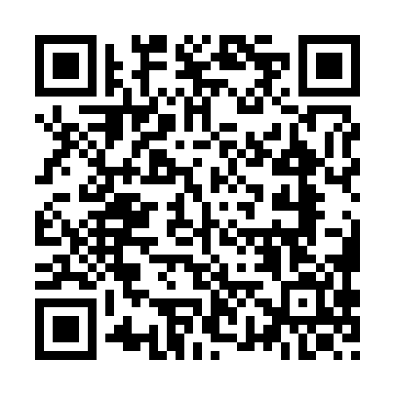
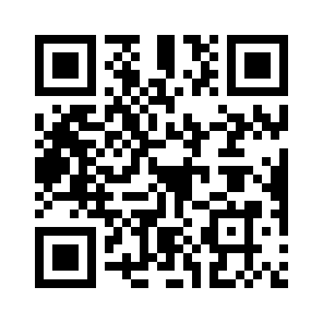

# Primo utilizzo
Al primo utilizzo, è necessario associare alla telecamera una (o più) reti wifi
con accesso a internet. Il nome della rete e la password vengono memorizzati
dall’unità. La procedura dovrà essere ripetuta nel caso in cui:
1. Il nome o la password della rete vengano modificati
2. Si vuole associare l’unità a una nuova rete (quelle vecchie rimangono comunque in memoria)

## Requisiti
- Un dispositivo che possa connettersi a una rete wifi con un browser (telefono, tablet, PC, etc.)
- Una rete wifi con accesso a internet di cui si conosce il nome e la password e che **non richieda successiva autenticazione** tramite browser

Attenzione, se la rete è creata come hotspot da telefono, è necessario avere un secondo dispositivo (un altro telefono, un tablet o PC) per effettuare questa procedura (non è possibile farla dallo stesso dispositivo che crea la connessione).
## Procedura di associazione
1. Assicurati che l’hotspot o la rete wifi siano attivi prima di accendere
l’unità.
2. Accendi l’unità. Se non rileva nessuna rete conosciuta dopo qualche
minuto inizierà a fare 2 lampeggi ravvicinati: è nella modalità di associazione a una nuova rete
**Attenzione per la procedura usa un dispositivo diverso da quello che fa da hotspot**.
### a) con QR code
3. inquadra il QR code sottostante con un dispositivo che può connettersi a una rete wifi
    

        
    

4. inquadra il secondo QR code per essere reindirizzato alla pagina di configurazione TwinPlay
    

        
    

### b) senza QR code
3. Collegati alla rete **TwinPlay** con password **TwinPlayCamera** (la rete non ha
accesso a internet, è giusto che sia così). Puoi anche utilizzare il seguente QR code per connetterti automaticamente alla rete TwinPlay:
4. Apri il browser (Chrome, Safari, etc.) e vai alla pagina **http://192.168.4.1:5000**, si aprirà la pagina di configurazione TwinPlay:
### Salvataggio rete
5. Seleziona la rete WIFI a cui vuoi collegare la telecamera, inserisci la
password e schiaccia sul tasto “Connetti”
6. Attendi 1 minuto.

Se l’associazione è andata a buon fine, la spia inizierà a
**lampeggiare regolarmente**, iniziando direttamente a riprendere l’allenamento. Se la spia ritorna a lampeggiare con 2 impulsi ravvicinati l’associazione non è andata a buon fine: verifica che la connessione abbia
accesso a internet e che la password inserita sia corretta.

[Back to index](README.md)

[&laquo; Unboxing](unboxing.md) | [Istruzioni utilizzo &raquo;](istruzioni_utilizzo.md)
