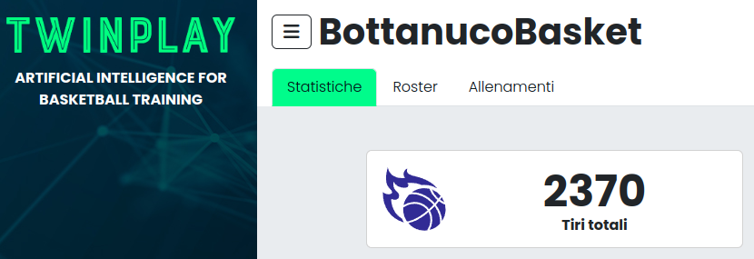

# Istruzioni navigazione webapp
## Accesso

    

1. Collegati al sito [app.twinplay.ai](https://app.twinplay.ai)
2. Inserisci le credenziali fornite dall'amministratore
3. Clicca su `Login`

## Dashboard

Puoi scegliere tra 3 sezioni:
1. **Statistiche**: visualizza i dati relativi a tutti gli allenamenti effettuati:
    - Tiri effettuati
    - percentuali
    - mappe di tiro
    - strisce
    - classifiche
    - andamento temporale
2. **Roster**: visualizza i giocatori registrati, permette di aggiungerne nuovi e di visualizzare dati e statistiche personali:
    - Seleziona un giocatore dalla lista per visualizzare i dati e le statistiche
    - Modifica i dati personali e inserisci la foto del profilo
3. **Allenamenti**: permette di scegliere di visualizzare dati e video di allenamenti specifici:
    - Seleziona un allenamento dalla lista per visualizzare i dati e i video
    - Clicca su `Video` per visualizzare i video dell'allenamento
    - Puoi scaricare i video e condividerli sui social. Se ti fa piacere, <ins>tagga TwinPlay.ai!</ins>

[Back to index](README.md)
